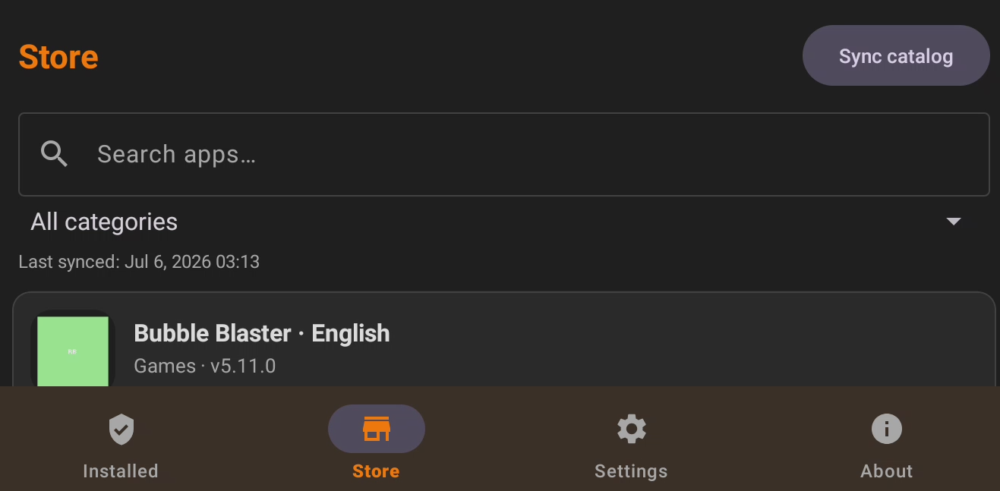

# Suitefish Android App

> [!TIP]
> This tool is actively maintained as a private scientific utility. Feature requests and bug reports are welcome via GitHub Issues and will be reviewed within 1–3 weeks.

            


## 🔍 What is this repository about?

Suitefish is a lightweight, free and open-source **app store client for Android**. It connects to a Suitefish catalog server over HTTPS, lists the apps published there, and lets you download and install them directly on your device — outside of the official app stores.

By default the app talks to the official `suitefish.com` catalog, but you can point it at **your own custom server** instead, making it a simple way to distribute and self-host Android apps. The app ships with no ads and adds no tracking of its own.

> [!Warning]
> Suitefish installs software from an online source outside of official app stores. Only connect to servers you fully trust. A wrong, malicious or misconfigured server can expose you to malware or data leaks — you use the app and any custom server entirely at your own risk.

This repository holds the full source code, build assets and release artifacts for the Android app.



## ✨ Features

- **Store tab** — browse the remote catalog, search by name and filter by category.
- **Installed tab** — see which catalog apps are installed and which have updates available.
- **Download & install** — fetch APKs from the catalog server and install them via Android's package installer, with guided help for the "unknown sources" permission.
- **Update checks** — compare installed versions against the catalog and update with one tap.
- **Custom servers** — use the default `suitefish.com` catalog or connect to your own; HTTPS is required and enforced (with an optional, explicitly-confirmed toggle for self-signed certificates on servers you control).
- **Privacy-friendly** — offline-first local catalog, no ads, no in-app tracking; risk and privacy notices shown on start.
- **Settings** — switch servers, reset local data (catalog, cached images, downloaded APKs) and revisit the help notices at any time.

## 🚀 Building from source

The Android project lives in the [`_source`](./_source) folder and uses the Gradle wrapper.

```bash
cd _source
./gradlew :app:assembleRelease   # or assembleDebug
```

The release APK is written to `_source/app/build/outputs/apk/release/`. Note that the release build is **unsigned** by default — sign it with your own keystore before distributing it.

- **Minimum Android:** 7.0 (API 24) · **Target:** API 36
- **Language:** Java · **Build system:** Gradle (Android Gradle Plugin)

## ❓ Support Channels

If you encounter any issues or have questions while using this software, feel free to contact us:

- **GitHub Issues** is the main platform for reporting bugs, asking questions, or submitting feature requests: [https://github.com/bugfishtm/suitefish-android/issues](https://github.com/bugfishtm/suitefish-android/issues)
- **Discord Community** is available for live discussions, support, and connecting with other users: [Join us on Discord](https://discord.com/invite/xCj7AEMmye)  
- **Email support** is recommended only for urgent security-related issues: [security@bugfish.eu](mailto:security@bugfish.eu)

## 📁 Repository Structure 

This table provides an overview of key files and folders related to the repository. Click on the links to access each file for more detailed information. If certain folders are missing from the repository, they are irrelevant to this project.

| Document Type | Description |
|----|-----|
| .github | Folder containing GitHub configuration, issue/PR templates and workflow files. |
| [.github/CODE_OF_CONDUCT.md](./.github/CODE_OF_CONDUCT.md) | Community guidelines for participation. |
| .gitattributes | Git configuration file for repository attributes (dev use). |
| .gitignore | Git configuration file for ignored files/folders (dev use). |
| [_source](./_source) | The Android Studio / Gradle project — full app source code. |
| [_releases](./_releases) | Published release artifacts (APK builds). |
| [_changelogs](./_changelogs) | Per-version changelog files. |
| [_screenshots](./_screenshots) | Screenshots of the app. |
| [_images](./_images) | Image and branding assets. |
| [_licenses](./_licenses) | License texts for bundled third-party libraries. |
| _archive | Archived and test assets (dev use). |
| github_reset.bat | Batch script to reset the repository (dev use). |
| github_update.bat | Batch script to update the repository (dev use). |
| [CONTRIBUTING.md](CONTRIBUTING.md) | Guidelines and instructions for contributors. |
| [CHANGELOG.md](CHANGELOG.md) | Main changelog file summarizing project changes. |
| [SECURITY.md](SECURITY.md) | Security policy and reporting instructions. |
| [LICENSE.md](LICENSE.md) | Project license and usage terms. |
| [README.md](README.md) | Main readme file (you are currently viewing this). |

## 🧩 Third-Party Components &amp; Licenses

The app is built on the following open-source libraries, which are bundled into the release APK. Each remains under its own license — refer to the respective project for the full terms, and see the [`_licenses`](./_licenses) folder.

| Component | Used for | License |
|----|----|----|
| [AndroidX Activity](https://developer.android.com/jetpack/androidx/releases/activity) | Activity APIs and lifecycle | Apache-2.0 |
| [AndroidX AppCompat](https://developer.android.com/jetpack/androidx/releases/appcompat) | Backward-compatible UI components | Apache-2.0 |
| [Material Components for Android](https://github.com/material-components/material-components-android) | Material Design UI widgets | Apache-2.0 |
| [AndroidX ConstraintLayout](https://developer.android.com/jetpack/androidx/releases/constraintlayout) | Flexible layout engine | Apache-2.0 |
| [AndroidX RecyclerView](https://developer.android.com/jetpack/androidx/releases/recyclerview) | Efficient scrolling lists | Apache-2.0 |
| [AndroidX SwipeRefreshLayout](https://developer.android.com/jetpack/androidx/releases/swiperefreshlayout) | Pull-to-refresh gesture | Apache-2.0 |

Testing tooling (JUnit, AndroidX Test, Espresso) is used during development only and is **not** shipped in the release APK.

## 📜 License Information

Suitefish is released under the **GNU General Public License v3.0**. The full license can be found in the [LICENSE.md](LICENSE.md) file. 

🐟 Bugfish 
